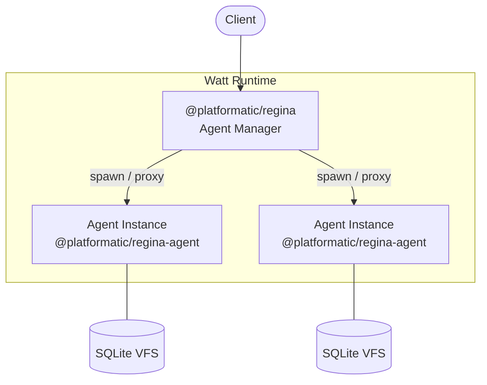
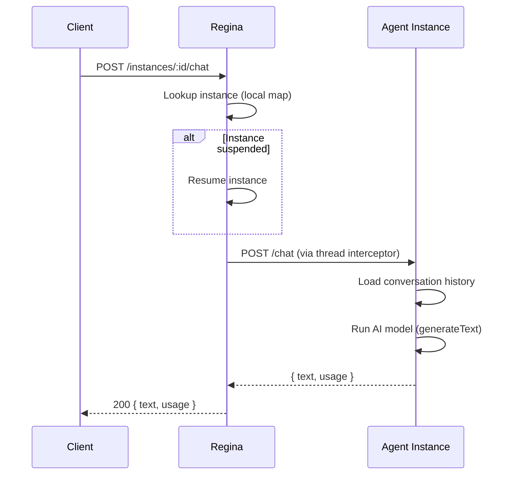
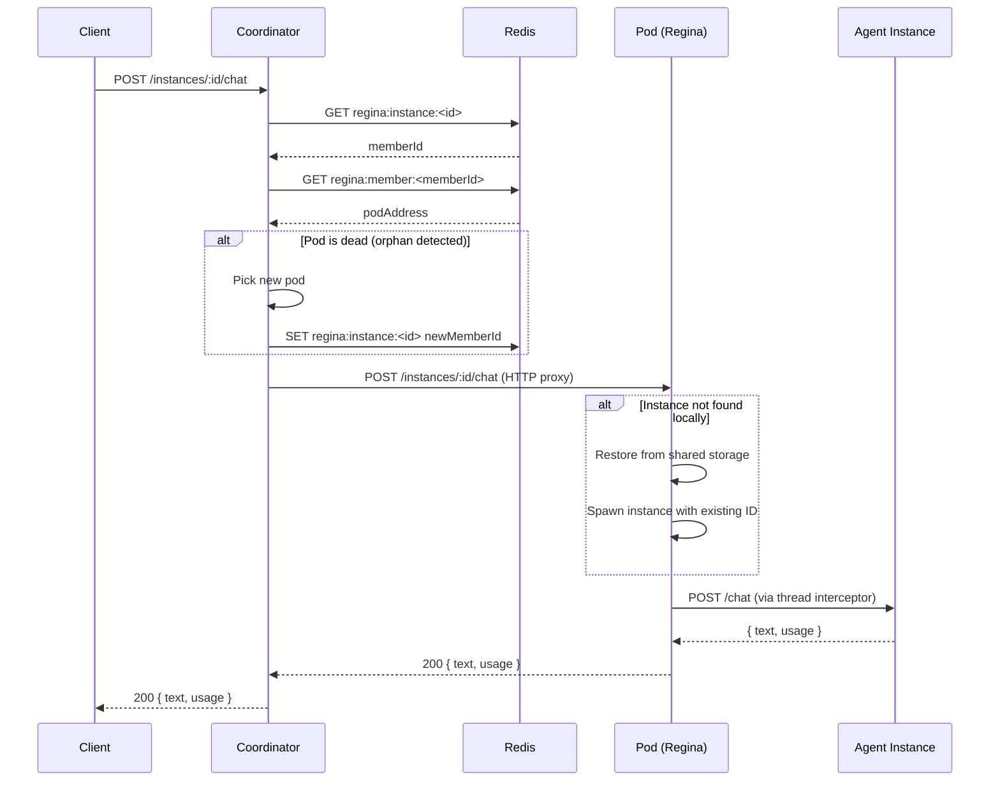
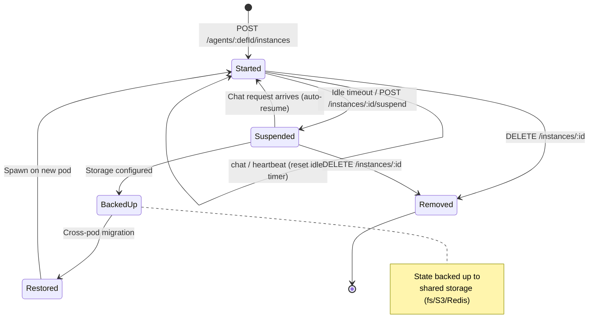
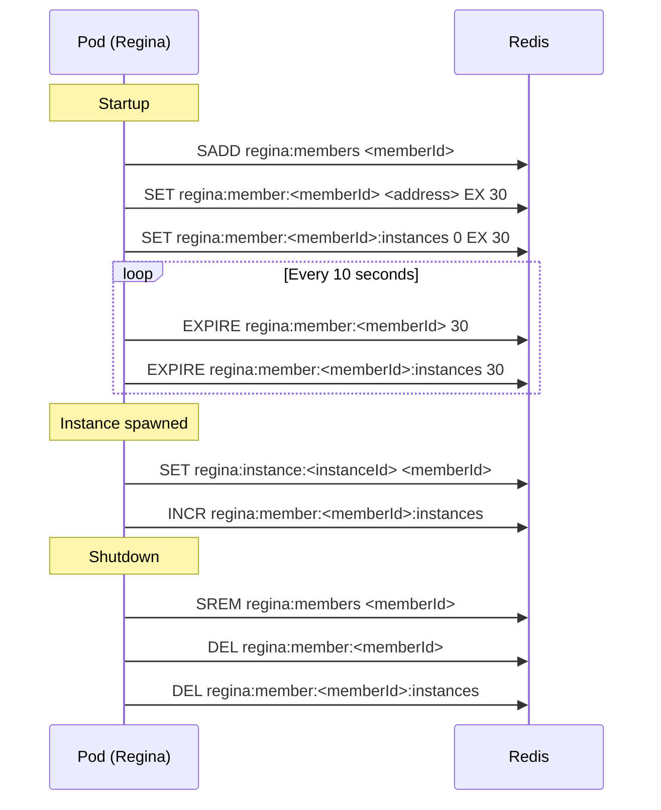
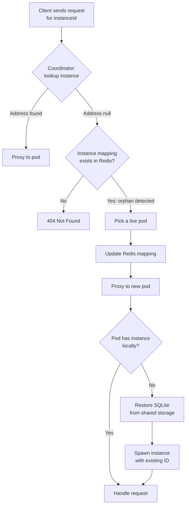
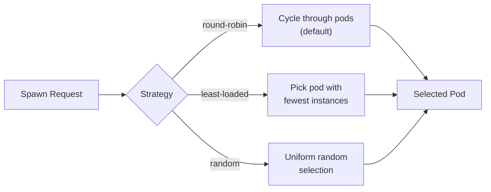
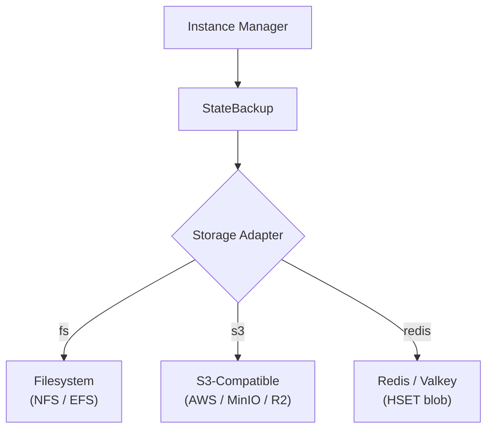
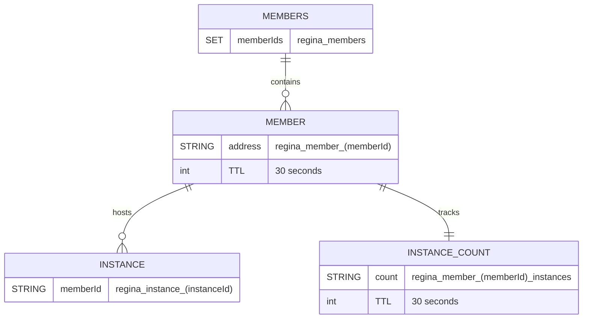
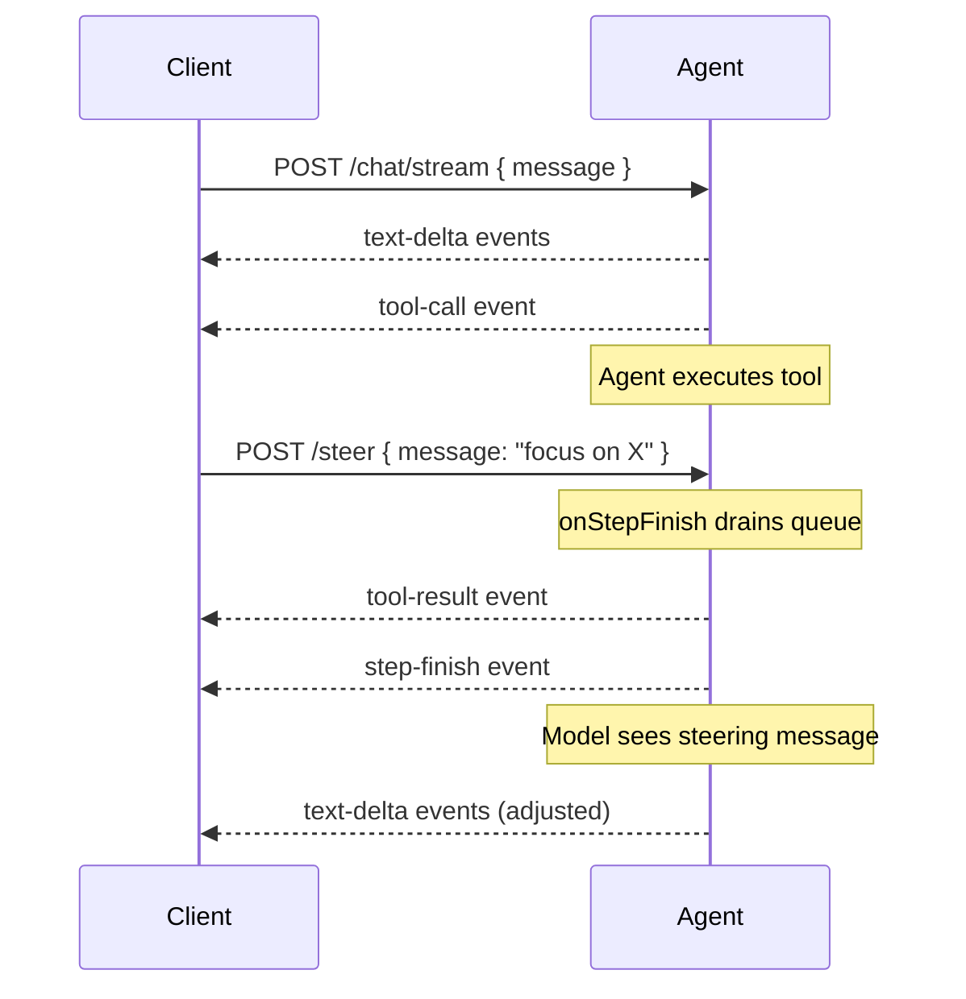

# Regina - AI Agent Orchestrator for Platformatic Watt

[](https://github.com/platformatic/regina/actions/workflows/ci.yml)

Regina is a multi-pod AI agent orchestrator for [Platformatic Watt](https://github.com/platformatic/platformatic). It discovers agent definitions from markdown files, spawns each agent as an isolated application thread, and manages the full instance lifecycle including idle suspension, cross-pod migration, and SQLite state backup.

## Packages

| Package                                                    | Description                                 |
| ---------------------------------------------------------- | ------------------------------------------- |
| [`@platformatic/regina`](packages/regina/)                 | Per-pod agent manager stackable             |
| [`@platformatic/regina-agent`](packages/regina-agent/)     | Per-agent runtime stackable                 |
| [`@platformatic/regina-storage`](packages/regina-storage/) | Pluggable storage adapters for state backup |

## Architecture

Regina works standalone as a single pod or scales horizontally with an optional coordinator.

### Single-Pod (default)

A single Watt runtime is fully functional. No Redis, no shared storage, no coordinator needed.



## Agent Definition Format

Each agent is a markdown file in `agents/` with YAML frontmatter:

```markdown
---
name: support-agent
description: Customer support assistant
model: claude-sonnet-4-5
provider: anthropic
tools:
  - ./tools/search-docs.ts
temperature: 0.7
maxSteps: 10
---

You are a helpful customer support agent.

## Guidelines

- Always be polite and professional
- Search the documentation before answering questions
```

### Frontmatter Fields

| Field         | Required | Description                                                                           |
| ------------- | -------- | ------------------------------------------------------------------------------------- |
| `name`        | Yes      | Unique agent identifier                                                               |
| `description` | No       | Human-readable description                                                            |
| `model`       | Yes      | Model identifier (e.g., `claude-sonnet-4-5`, `gpt-4o`, `anthropic/claude-sonnet-4-5`) |
| `provider`    | No       | AI provider name (inferred from model if omitted)                                     |
| `tools`       | No       | Array of paths to tool modules (relative to .md file)                                 |
| `mcpServers`  | No       | Array of remote MCP server connections (see below)                                    |
| `temperature` | No       | Model temperature                                                                     |
| `maxSteps`    | No       | Max agentic loop steps (default: 10)                                                  |

### Providers

| Provider         | Env Variable         | Inferred When                                            |
| ---------------- | -------------------- | -------------------------------------------------------- |
| `anthropic`      | `ANTHROPIC_API_KEY`  | Model starts with `claude` or `anthropic`                |
| `openai`         | `OPENAI_API_KEY`     | Model starts with `gpt`, `o1`, `o3`, or `o4`             |
| `vercel-gateway` | `AI_GATEWAY_API_KEY` | Model contains `/` (e.g., `anthropic/claude-sonnet-4-5`) |

The provider is inferred from the model name when omitted. You can always set it explicitly to override inference.

#### Vercel AI Gateway

The [Vercel AI Gateway](https://vercel.com/docs/ai-gateway) provides access to hundreds of models from multiple providers through a single API key. To use it, set the `AI_GATEWAY_API_KEY` environment variable and use the `provider/model` format for the model name:

```markdown
---
name: support-agent
model: anthropic/claude-sonnet-4-5
---

You are a helpful support agent.
```

Or set the provider explicitly:

```markdown
---
name: support-agent
model: anthropic/claude-sonnet-4-5
provider: vercel-gateway
---

You are a helpful support agent.
```

## Request Flow

### Single-Pod Chat Request



### Multi-Pod Chat Request (via Coordinator)



## Instance Lifecycle



## Built-in Tools

Every agent instance gets default tools backed by a per-instance virtual filesystem (SQLite VFS):

| Tool         | Description                                                           |
| ------------ | --------------------------------------------------------------------- |
| `bash`       | Execute bash commands inside the virtual filesystem                   |
| `read_file`  | Read file contents from the virtual filesystem                        |
| `write_file` | Write content to a file, creating parent directories as needed        |
| `edit_file`  | Replace a unique substring in a file (old_string/new_string approach) |

Custom tools defined in the agent definition override built-in tools with the same name. MCP tools sit between defaults and custom tools in priority: `{ ...defaultTools, ...mcpTools, ...userTools, delegate }`.

### MCP Servers

Agents can connect to remote MCP servers via SSE or Streamable HTTP transport:

```yaml
mcpServers:
  - name: web-search
    transport: sse
    url: http://localhost:3001/sse
  - name: api-server
    transport: http
    url: http://localhost:3002/mcp
    headers:
      Authorization: 'Bearer token'
```

Tools are prefixed with the server name (e.g., `web-search_search`). Failed connections are skipped with a warning.

### Custom Tool Definition

Tools are JS/TS modules exporting a Vercel AI SDK `tool()`:

```ts
import { tool } from 'ai'
import { z } from 'zod'

export default tool({
  description: 'Search the documentation',
  parameters: z.object({
    query: z.string().describe('The search query')
  }),
  execute: async ({ query }) => {
    return { results: [] }
  }
})
```

## Multi-Pod Features

These features are all **conditional** -- they activate only when the relevant config is provided. Without them, Regina works as a zero-dependency single-pod system.

### Pod Registration (requires `redis`)



### Orphan Detection & Cross-Pod Migration

When a pod crashes, its Redis keys expire (TTL 30s). The coordinator detects orphaned instances and transparently reassigns them to live pods.



### Allocation Strategies

The coordinator supports pluggable strategies for choosing which pod receives a new instance:



| Strategy       | Description                             | Best For                            |
| -------------- | --------------------------------------- | ----------------------------------- |
| `round-robin`  | Cycles through pods in order (default)  | Even distribution, predictable      |
| `least-loaded` | Picks pod with fewest running instances | Balanced workload                   |
| `random`       | Uniform random selection                | Avoiding thundering herd on restart |

### Storage Adapters (requires `storage`)



All adapters implement the same interface: `put`, `get`, `delete`, `list`, `close`.

## Redis Key Schema



| Key                                  | Type   | TTL | Description                      |
| ------------------------------------ | ------ | --- | -------------------------------- |
| `regina:members`                     | SET    | --  | Set of all registered member IDs |
| `regina:member:<memberId>`           | STRING | 30s | Pod's routable address           |
| `regina:member:<memberId>:instances` | STRING | 30s | Running instance count           |
| `regina:instance:<instanceId>`       | STRING | --  | Maps instance to its member      |

## Configuration

### Single-Pod (`platformatic.json`)

```json
{
  "module": "@platformatic/regina",
  "regina": {
    "agentsDir": "./agents"
  }
}
```

### Single-Pod with All Options

```json
{
  "module": "@platformatic/regina",
  "regina": {
    "agentsDir": "./agents",
    "vfsDir": "./vfs",
    "idleTimeout": 300,
    "useProcesses": false,
    "factory": "./factory.mjs",
    "defaults": {
      "provider": "anthropic",
      "model": "claude-sonnet-4-5",
      "maxSteps": 10
    }
  }
}
```

### Multi-Pod: Per-Pod Regina

```json
{
  "module": "@platformatic/regina",
  "regina": {
    "agentsDir": "./agents",
    "redis": "redis://valkey:6379",
    "memberAddress": "{POD_IP}:3001",
    "memberId": "{HOSTNAME}",
    "storage": {
      "type": "s3",
      "bucket": "regina-state",
      "endpoint": "https://s3.amazonaws.com"
    }
  }
}
```

### Custom Factory

You can customize how Regina prepares each spawned application with `regina.factory`.
The module must export `prepareApplication(instanceId, definition)` and return the application arguments passed to Watt management.

```js
export async function prepareApplication (instanceId, definition) {
  return {
    id: instanceId,
    path: '/tmp/custom-app',
    config: `${definition.id}:${instanceId}`,
    env: { FACTORY: '1' }
  }
}
```

If the export is missing, Regina uses the default internal factory.

### Process Mode

Set `regina.useProcesses` to `true` to run each `@platformatic/regina-agent` instance in a separate Node.js process instead of in-process runtime mode.

## REST API

### Agent Definitions

- `GET /agents` -- List all discovered agent definitions
- `GET /agents/:defId` -- Get a specific agent definition

### Agent Instances

- `POST /agents/:defId/instances` -- Spawn a new agent instance
- `GET /agents/:defId/instances` -- List running instances
- `POST /instances/:instanceId/heartbeat` -- Keep instance alive (reset idle timer)
- `POST /instances/:instanceId/suspend` -- Backup and stop an instance
- `DELETE /instances/:instanceId` -- Teardown an instance

### Chat

- `POST /instances/:instanceId/chat` -- Synchronous chat (JSON request/response)
- `POST /instances/:instanceId/chat/stream` -- NDJSON streaming chat (rich events)
- `POST /instances/:instanceId/steer` -- Inject a steering message into the running agent loop
- `GET /instances/:instanceId/messages` -- Get conversation history

All endpoints are available on both the per-pod Regina API and the coordinator gateway (which proxies to the correct pod).

### Streaming Format

The `/chat/stream` endpoint returns `application/x-ndjson` -- one JSON object per line. Event types include:

- `{"type":"text-delta","textDelta":"Hello"}` -- Incremental text
- `{"type":"tool-call","toolCallId":"1","toolName":"search","args":{...}}` -- Tool invocation
- `{"type":"tool-result","toolCallId":"1","result":{...}}` -- Tool result
- `{"type":"step-finish","finishReason":"tool-calls",...}` -- Step boundary

### Steering

While an agent is running an agentic loop (multi-step tool use), the client can send steering messages that get injected between steps:



The steering message is pushed to an in-memory queue and drained into the conversation as a user message at the next step boundary. The model sees it on the subsequent iteration.

## Session Persistence

Agent conversations are automatically persisted to the VFS as JSONL at `/.session/messages.jsonl`. On restart, the conversation history is restored so sessions survive across agent restarts. New messages are appended incrementally; a full rewrite occurs only after context compaction.

## Context Compaction

Long agent conversations are automatically compacted to stay within model context limits. When the estimated token count exceeds a threshold, older messages are summarized using the model itself, while recent messages are preserved verbatim.

| Option      | Default   | Description                                    |
| ----------- | --------- | ---------------------------------------------- |
| `threshold` | `100,000` | Estimated token count that triggers compaction |
| `keepLastN` | `10`      | Number of recent messages preserved verbatim   |

## Development

```bash
pnpm install
pnpm run build
pnpm run test
pnpm run lint
```

### Local Multi-Pod Development

The root `watt.json` starts a coordinator + pod for local development:

```bash
npx wattpm start
```

This requires a local Redis/Valkey instance running on `localhost:6379`.

## License

Apache-2.0
