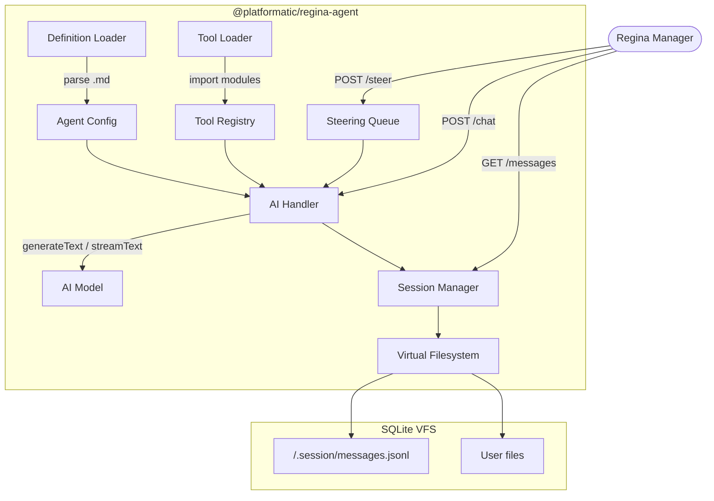
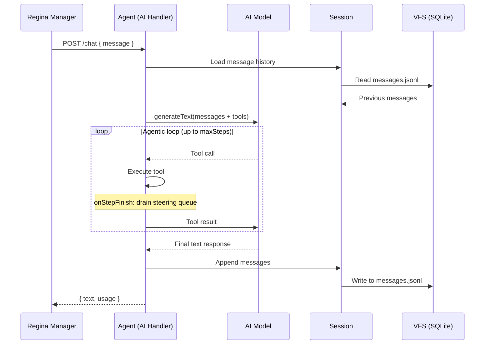
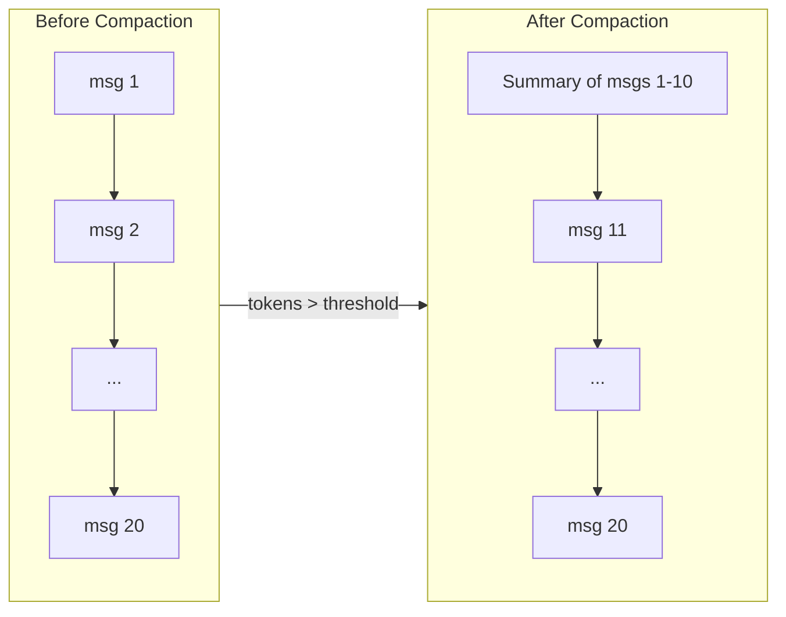

# @platformatic/regina-agent

Per-agent runtime stackable for [Platformatic Watt](https://github.com/platformatic/platformatic). Each agent instance runs as an isolated application thread, handling AI chat via the [Vercel AI SDK](https://sdk.vercel.ai/), managing conversation sessions, and providing a sandboxed virtual filesystem.

This package is not used directly -- it is spawned by `@platformatic/regina` when a new agent instance is created.

## How It Works



## Agent Definition

Agents are defined as markdown files with YAML frontmatter. The markdown body becomes the system prompt.

```markdown
---
name: support-agent
description: Customer support assistant
model: claude-sonnet-4-5
provider: anthropic
tools:
  - ./tools/search-docs.ts
temperature: 0.7
maxSteps: 10
---

You are a helpful customer support agent.
```

## Built-in Tools

Every instance gets four default tools backed by the SQLite VFS:

| Tool | Description |
|---|---|
| `bash` | Execute shell commands in the virtual filesystem |
| `read_file` | Read file contents |
| `write_file` | Write/create files with automatic parent directory creation |
| `edit_file` | Find-and-replace within a file |

Custom tools from the agent definition override built-in tools with the same name. MCP tools sit between defaults and custom tools in priority.

## MCP Servers

Agents can connect to remote MCP (Model Context Protocol) servers. Only remote transports (`sse` and `http`) are supported.

```markdown
---
name: support-agent
model: claude-sonnet-4-5
mcpServers:
  - name: web-search
    transport: sse
    url: http://localhost:3001/sse
  - name: api-server
    transport: http
    url: http://localhost:3002/mcp
    headers:
      Authorization: "Bearer token"
---

You are a support agent with access to web search.
```

Tools from MCP servers are prefixed with the server name (e.g., `web-search_search`) to avoid collisions. If a server fails to connect, it is skipped with a warning -- one bad server does not prevent the agent from starting.

Tool merge order: `{ ...defaultTools, ...mcpTools, ...userTools, delegate }`.

## Custom Tools

Tools are JS/TS modules exporting a Vercel AI SDK `tool()`:

```ts
import { tool } from 'ai'
import { z } from 'zod'

export default tool({
  description: 'Search the knowledge base',
  parameters: z.object({
    query: z.string()
  }),
  execute: async ({ query }) => {
    return { results: [] }
  }
})
```

## Chat Flow



## Session Persistence

Conversations are stored as JSONL in the VFS at `/.session/messages.jsonl`. Messages are appended incrementally. On restart, the full history is restored.

## Context Compaction

When the estimated token count exceeds a threshold (default: 100,000), older messages are automatically summarized by the model:



| Option | Default | Description |
|---|---|---|
| `threshold` | `100,000` | Token count that triggers compaction |
| `keepLastN` | `10` | Recent messages preserved verbatim |

## Rich Streaming

The `/chat/stream` endpoint returns `application/x-ndjson` with structured events from the AI SDK's `fullStream`. Each line is a JSON object:

- `text-delta` -- incremental text chunks
- `tool-call` -- tool invocation with name and arguments
- `tool-result` -- tool execution result
- `step-finish` -- step boundary with finish reason

This gives clients full visibility into tool calls, results, and step boundaries rather than just raw text.

## Steering

The `POST /steer` endpoint accepts `{ message }` and queues it for injection into the agentic loop. At each `onStepFinish` boundary, pending steering messages are drained into the conversation as user messages. The model sees them on the next iteration, allowing clients to redirect the agent mid-task.

## Heartbeat

When running in a Watt runtime, the agent sends periodic heartbeats to the parent regina manager to signal it is alive and reset the idle timer.

## Configuration

These options are set automatically by `@platformatic/regina` when spawning an instance:

| Option | Description |
|---|---|
| `definitionPath` | Path to the agent's markdown definition file |
| `toolsBasePath` | Base directory for resolving tool module paths |
| `vfsDbPath` | Path to the SQLite database for this instance's VFS |
| `apiKey` | AI provider API key (injected from environment) |
| `coordinatorId` | Parent service ID in the Watt runtime |
| `instanceId` | This instance's unique identifier |

## License

Apache-2.0
