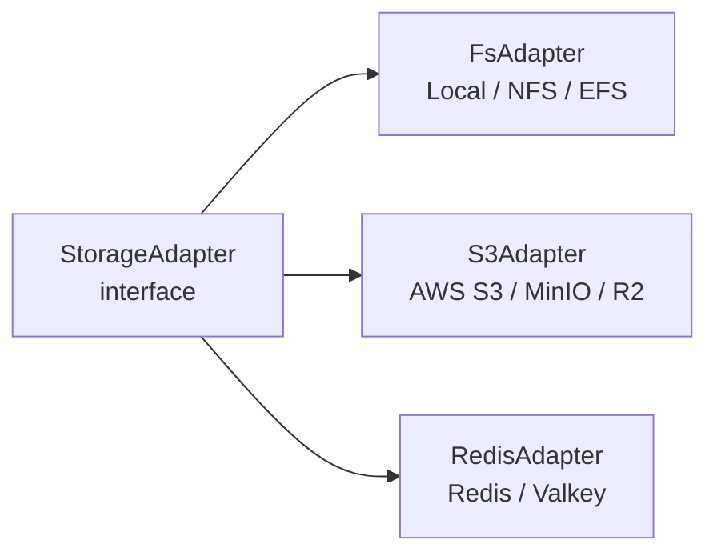
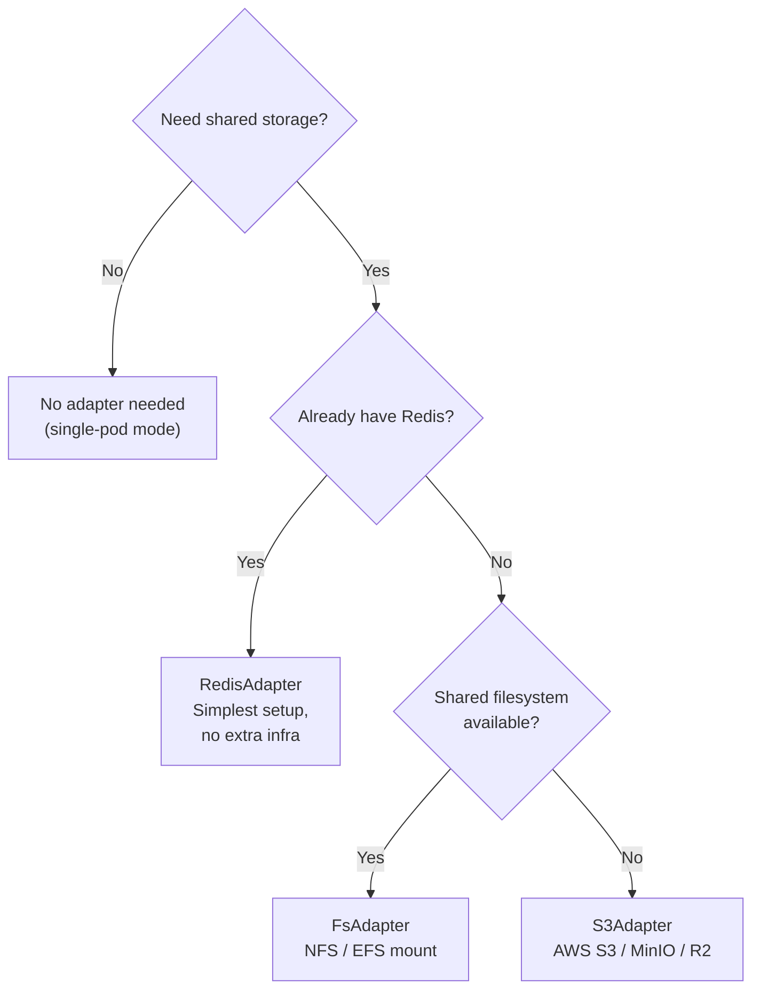

# @platformatic/regina-storage

Pluggable storage adapters for [Regina](../../) SQLite state backup and restore. Used by `@platformatic/regina` to persist instance state to shared storage for cross-pod migration in multi-pod deployments.

## Adapters



All adapters implement the same interface:

```ts
interface StorageAdapter {
  put(key: string, data: Buffer): Promise<void>
  get(key: string): Promise<Buffer | null>
  delete(key: string): Promise<void>
  list(prefix: string): Promise<string[]>
  close(): Promise<void>
}
```

Keys are instance IDs. Data is the raw SQLite file content.

## FsAdapter

Stores files on the local (or network-mounted) filesystem. Suitable for shared volumes like NFS or AWS EFS.

```ts
import { FsAdapter } from '@platformatic/regina-storage'

const adapter = new FsAdapter({ basePath: '/mnt/shared/regina-state' })

await adapter.put('instance-abc123', sqliteBuffer)
const data = await adapter.get('instance-abc123')  // Buffer or null
await adapter.delete('instance-abc123')
const keys = await adapter.list('instance-')
await adapter.close()
```

| Option | Description |
|---|---|
| `basePath` | Directory where `.sqlite` files are stored |

Files are written as `<basePath>/<key>.sqlite`.

## S3Adapter

Stores files in any S3-compatible object storage (AWS S3, MinIO, Cloudflare R2, etc.).

```ts
import { S3Adapter } from '@platformatic/regina-storage'

const adapter = new S3Adapter({
  bucket: 'regina-state',
  prefix: 'backups/',
  endpoint: 'https://s3.us-east-1.amazonaws.com',
  region: 'us-east-1'
})
```

| Option | Required | Description |
|---|---|---|
| `bucket` | Yes | S3 bucket name |
| `prefix` | No | Key prefix (e.g., `backups/`) |
| `endpoint` | No | S3 endpoint URL (for non-AWS providers) |
| `region` | No | AWS region |

Objects are stored as `<prefix><key>.sqlite`.

## RedisAdapter

Stores SQLite files as binary blobs in a Redis hash. The simplest option -- reuses an existing Redis connection if one is already available for pod registration.

```ts
import { Redis } from 'iovalkey'
import { RedisAdapter } from '@platformatic/regina-storage'

const redis = new Redis('redis://localhost:6379')
const adapter = new RedisAdapter({ client: redis })
```

| Option | Description |
|---|---|
| `client` | An existing iovalkey `Redis` client instance |

Data is stored in the `regina:state` hash: `HSET regina:state <key> <data>`.

The `close()` method is a no-op (the caller owns the Redis client lifecycle).

## Usage with Regina

In `platformatic.json`, configure the `storage` option:

### Filesystem

```json
{
  "regina": {
    "storage": {
      "type": "fs",
      "basePath": "/mnt/shared/regina-state"
    }
  }
}
```

### S3

```json
{
  "regina": {
    "storage": {
      "type": "s3",
      "bucket": "regina-state",
      "endpoint": "https://s3.amazonaws.com"
    }
  }
}
```

### Redis

```json
{
  "regina": {
    "storage": {
      "type": "redis"
    }
  }
}
```

When `type` is `redis`, the adapter reuses the same Redis connection created for pod registration (if `redis` config is also set).

## Adapter Selection Guide



## License

Apache-2.0
