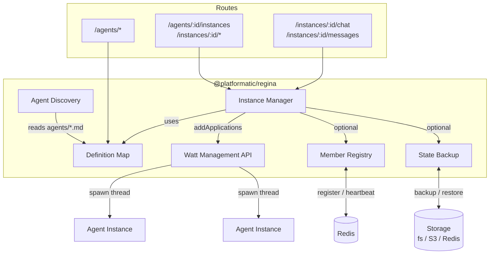
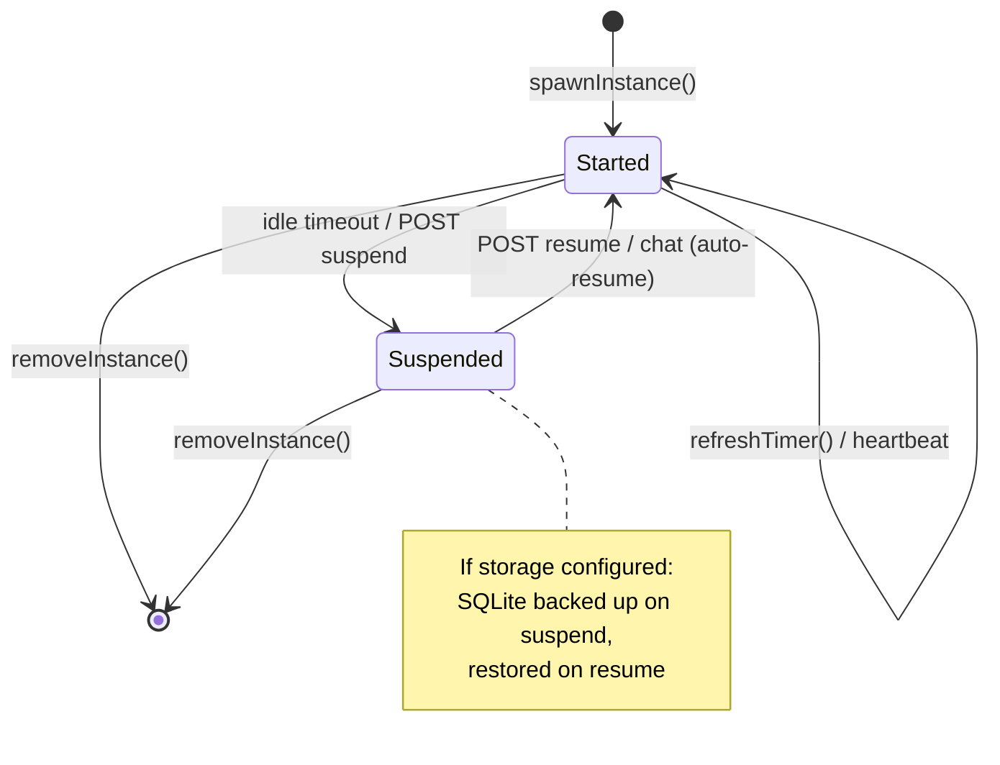
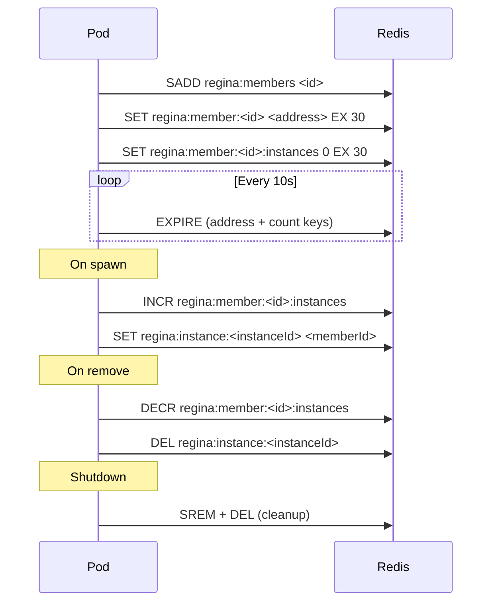

# @platformatic/regina

Per-pod AI agent manager for [Platformatic Watt](https://github.com/platformatic/platformatic). Discovers agent definitions from markdown files, spawns each agent as an isolated application thread, and manages the full instance lifecycle.

Works standalone as a single-pod system with zero external dependencies. Optionally connects to Redis for multi-pod deployments with self-registration, instance tracking, and shared storage backup.

## How It Works



## Configuration

All options go under the `regina` key in `platformatic.json`:

| Option              | Default    | Description                                                                                 |
| ------------------- | ---------- | ------------------------------------------------------------------------------------------- |
| `agentsDir`         | `./agents` | Directory containing agent definition `.md` files                                           |
| `vfsDir`            | `./vfs`    | Directory for per-instance SQLite VFS databases                                             |
| `idleTimeout`       | `300`      | Seconds of inactivity before auto-suspending an instance                                    |
| `useProcesses`      | `false`    | Run each agent instance as a separate Node.js process                                       |
| `factory`           | --         | Local module path or `npm:<package>` exporting `prepareApplication(instanceId, definition)` |
| `defaults.provider` | --         | Default AI provider for all agents                                                          |
| `defaults.model`    | --         | Default model for all agents                                                                |
| `defaults.maxSteps` | `10`       | Default max agentic loop steps                                                              |

### Custom Application Factory

Use `regina.factory` to override how instance applications are prepared before spawn.

`factory` can be:

- a local module path (relative to the Platformatic root)
- an installed package in `npm:<package-name>` form

Both forms must export:

```js
export async function prepareApplication (instanceId, definition) {
  return {
    id: instanceId,
    path: '/absolute/or/runtime/path/to/application',
    config: '/path/to/config-or-config-object',
    env: { FACTORY: '1' }
  }
}
```

If `prepareApplication` is missing, Regina falls back to the built-in factory.

### Process Mode

Set `regina.useProcesses` to `true` to run each `@platformatic/regina-agent` instance as a dedicated Node.js process.

### Multi-Pod Options (all optional)

| Option             | Description                                                 |
| ------------------ | ----------------------------------------------------------- |
| `redis`            | Redis/Valkey connection URL. Enables pod self-registration. |
| `memberAddress`    | This pod's routable address (e.g., from `POD_IP` env var)   |
| `memberId`         | Unique pod identifier (e.g., hostname)                      |
| `storage.type`     | Storage adapter: `fs`, `s3`, or `redis`                     |
| `storage.basePath` | Filesystem adapter: base directory path                     |
| `storage.bucket`   | S3 adapter: bucket name                                     |
| `storage.prefix`   | S3 adapter: key prefix                                      |
| `storage.endpoint` | S3 adapter: endpoint URL                                    |
| `storage.region`   | S3 adapter: AWS region                                      |

## Instance Lifecycle



### Cross-Pod Restore

When a pod receives a request for an instance it doesn't have locally (e.g., after the coordinator reassigns an orphan), it automatically:

1. Checks shared storage for a backup
2. Restores the SQLite file locally
3. Spawns the instance with the original ID
4. Handles the request normally

## REST API

### Agents

- `GET /agents` -- List all discovered agent definitions
- `GET /agents/:defId` -- Get a specific agent definition

### Instances

- `POST /agents/:defId/instances` -- Spawn a new instance
- `GET /agents/:defId/instances` -- List instances for a definition
- `POST /instances/:instanceId/heartbeat` -- Reset idle timer
- `POST /instances/:instanceId/suspend` -- Suspend an instance (backup state and stop)
- `POST /instances/:instanceId/resume` -- Resume a suspended instance (restore state and start)
- `DELETE /instances/:instanceId` -- Remove an instance

### Chat

- `POST /instances/:instanceId/chat` -- Synchronous chat `{ message }` -> `{ text, usage }`
- `POST /instances/:instanceId/chat/stream` -- NDJSON streaming chat (rich events)
- `POST /instances/:instanceId/steer` -- Inject a steering message `{ message }` -> `{ queued: true }`
- `GET /instances/:instanceId/messages` -- Get conversation history

## Member Registry

When `redis` is configured, the pod self-registers on startup and maintains a heartbeat:



If the pod crashes, the 30-second TTL ensures stale entries are automatically cleaned up.

## License

Apache-2.0
